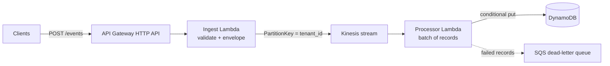

# AWS Event-Driven Ingestion: Reference Architecture

A small, tested reference implementation of a pattern I use for reliable, multi-tenant event ingestion on AWS: **API Gateway, Lambda, Kinesis, DynamoDB**, with idempotent consumers, partial-batch failure handling, a dead-letter queue and log redaction.

All code and data here are synthetic and independent of any employer.



## Design decisions

| Concern | Decision |
| --- | --- |
| Ordering | Partition by `tenant_id` so each tenant's events stay ordered within a shard |
| Duplicates | Every event has an `event_id`; the write is conditional (`attribute_not_exists`), so retries and replays are safe |
| Poison records | `ReportBatchItemFailures` and `BisectBatchOnFunctionError` isolate bad records; exhausted retries land in a DLQ |
| Sensitive data | Known sensitive fields are masked before anything is logged; streams and tables use encryption at rest |
| Backpressure | The stream buffers spikes; the API returns `202 Accepted` and never waits on the database |

Full reasoning and trade-offs: [ADR 001](docs/adr-001-kinesis-and-idempotent-consumers.md).

## Project layout

```
template.yaml            AWS SAM template (API, Lambdas, Kinesis, DynamoDB, DLQ)
src/ingest/app.py        Validates requests and publishes to Kinesis
src/processor/app.py     Consumes batches and writes idempotently
tests/test_functions.py  Unit tests (no AWS needed)
docs/                    Architecture decision records
```

## Run the tests

```
python -m unittest discover -s tests -v
```

## Deploy

```
sam build
sam deploy --guided
```

## What I would add for production

Alarms on iterator age, throttles and DLQ depth; per-tenant rate limiting at the API; schema validation with versioned contracts; distributed tracing; and an automated replay tool for the DLQ.
